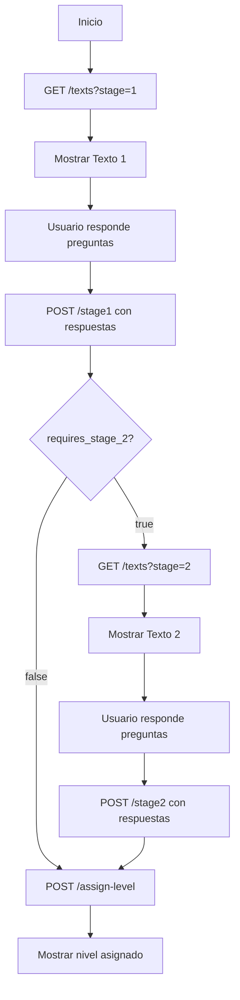

# 📋 Guía de Integración - API de Diagnóstico

## 🎯 Endpoint Principal

### GET `/api/v1/diagnostic/texts`

Obtiene los textos de diagnóstico con sus preguntas y alternativas para una etapa específica.

**URL Base:** `http://localhost:8000` (desarrollo)

**Parámetros Query:**
- `stage` (required): Número de etapa (`1` o `2`)

**Ejemplo de Request:**
```bash
GET /api/v1/diagnostic/texts?stage=1
GET /api/v1/diagnostic/texts?stage=2
```

---

## 📦 Estructura de Respuesta

```typescript
interface DiagnosticTextsResponse {
  stage: number                 // Etapa solicitada (1 o 2)
  texts: TextInfo[]            // Array de textos con preguntas
  message: string              // Mensaje descriptivo
}

interface TextInfo {
  text_id: number              // ID del texto
  title: string                // Título del texto
  content: string              // Contenido (puede ser HTML o texto plano)
  format: "plain" | "html"     // Formato del contenido
  questions: QuestionInfo[]    // Preguntas asociadas
}

interface QuestionInfo {
  question_id: number          // ID de la pregunta
  question_text: string        // Texto de la pregunta
  alternatives: AlternativeInfo[]
}

interface AlternativeInfo {
  alternative_id: number       // ID de la alternativa
  text: string                 // Texto de la alternativa
}
```

---

## 📝 Ejemplo de Respuesta Real

### Stage 1 (Texto Plano)
```json
{
  "stage": 1,
  "texts": [
    {
      "text_id": 1,
      "title": "La mentira del erizo",
      "content": "Hace mucho tiempo, en un bosque lejano...",
      "format": "plain",
      "questions": [
        {
          "question_id": 1,
          "question_text": "¿Qué hizo el erizo para verse mejor?",
          "alternatives": [
            {
              "alternative_id": 1,
              "text": "Se lavó bien las púas."
            },
            {
              "alternative_id": 2,
              "text": "Se peinó con mucho cuidado."
            },
            {
              "alternative_id": 3,
              "text": "Se cubrió el lomo con rosas."
            }
          ]
        }
      ]
    }
  ],
  "message": "Textos de diagnóstico para la etapa 1 obtenidos exitosamente."
}
```

### Stage 2 (Texto HTML con Imágenes)
```json
{
  "stage": 2,
  "texts": [
    {
      "text_id": 2,
      "title": "Tráfico animal",
      "content": "<div class=\"afiche-animales\"><h1>¡Miles de animales...</h1>...</div><style>...</style>",
      "format": "html",
      "questions": [
        {
          "question_id": 3,
          "question_text": "Según el texto, ¿qué es el tráfico de animales?",
          "alternatives": [...]
        }
      ]
    }
  ],
  "message": "Textos de diagnóstico para la etapa 2 obtenidos exitosamente."
}
```

---

## 💻 Implementación Frontend

### **Vue 3 + Composition API**

```vue
<template>
  <div class="diagnostic-container">
    <div v-if="loading">Cargando textos...</div>
    <div v-else-if="error" class="error">{{ error }}</div>
    
    <div v-else>
      <div v-for="text in diagnosticTexts" :key="text.text_id" class="text-section">
        <h2>{{ text.title }}</h2>
        
        <!-- Renderizar según formato -->
        <div v-if="text.format === 'html'" 
             v-html="text.content" 
             class="html-content">
        </div>
        <div v-else class="plain-content">
          {{ text.content }}
        </div>
        
        <!-- Preguntas -->
        <div v-for="question in text.questions" :key="question.question_id" class="question">
          <p class="question-text">{{ question.question_text }}</p>
          
          <div v-for="alt in question.alternatives" 
               :key="alt.alternative_id" 
               class="alternative">
            <label>
              <input type="radio" 
                     v-model="answers[question.question_id]"
                     :name="`q${question.question_id}`" 
                     :value="alt.alternative_id">
              {{ alt.text }}
            </label>
          </div>
        </div>
      </div>
      
      <button @click="submitAnswers" class="btn-submit">
        Enviar Respuestas
      </button>
    </div>
  </div>
</template>

<script setup>
import { ref, onMounted } from 'vue'
import axios from 'axios'

const diagnosticTexts = ref([])
const answers = ref({}) // { question_id: alternative_id }
const loading = ref(true)
const error = ref(null)

const props = defineProps({
  stage: {
    type: Number,
    required: true,
    validator: (value) => [1, 2].includes(value)
  }
})

const loadTexts = async () => {
  try {
    loading.value = true
    const response = await axios.get(
      `/api/v1/diagnostic/texts?stage=${props.stage}`
    )
    diagnosticTexts.value = response.data.texts
  } catch (err) {
    error.value = 'Error al cargar textos: ' + err.message
    console.error(err)
  } finally {
    loading.value = false
  }
}

const submitAnswers = async () => {
  // Validar que todas las preguntas tengan respuesta
  const allQuestions = diagnosticTexts.value.flatMap(t => t.questions)
  const unanswered = allQuestions.filter(q => !answers.value[q.question_id])
  
  if (unanswered.length > 0) {
    alert('Por favor responde todas las preguntas')
    return
  }
  
  // Preparar payload según el endpoint de stage1 o stage2
  const payload = {
    user_id: 123, // Obtener del store/contexto
    answers: Object.entries(answers.value).map(([qId, altId]) => ({
      question_id: parseInt(qId),
      selected_alternative_id: parseInt(altId)
    }))
  }
  
  try {
    const endpoint = props.stage === 1 
      ? '/api/v1/diagnostic/stage1'
      : '/api/v1/diagnostic/stage2'
    
    const response = await axios.post(endpoint, payload)
    console.log('Respuesta enviada:', response.data)
    
    // Manejar siguiente paso según la respuesta
    if (props.stage === 1 && response.data.requires_stage_2) {
      // Ir a stage 2
    } else if (response.data.assigned_level) {
      // Mostrar nivel asignado
    }
  } catch (err) {
    console.error('Error al enviar respuestas:', err)
    alert('Error al enviar las respuestas')
  }
}

onMounted(() => {
  loadTexts()
})
</script>

<style scoped>
.diagnostic-container {
  max-width: 1000px;
  margin: 0 auto;
  padding: 20px;
}

.text-section {
  margin-bottom: 40px;
}

/* El contenido HTML ya viene con sus propios estilos embebidos */
.html-content {
  margin: 20px 0;
}

.plain-content {
  white-space: pre-wrap;
  line-height: 1.8;
  font-size: 16px;
  color: #333;
  padding: 20px;
  background: #f9f9f9;
  border-radius: 8px;
}

.question {
  margin: 30px 0;
  padding: 20px;
  background: #ffffff;
  border: 1px solid #ddd;
  border-radius: 8px;
}

.question-text {
  font-weight: bold;
  font-size: 18px;
  margin-bottom: 15px;
  color: #2c3e50;
}

.alternative {
  margin: 10px 0;
}

.alternative label {
  display: flex;
  align-items: center;
  padding: 10px;
  cursor: pointer;
  border-radius: 4px;
  transition: background 0.2s;
}

.alternative label:hover {
  background: #f5f5f5;
}

.alternative input[type="radio"] {
  margin-right: 10px;
  cursor: pointer;
}

.btn-submit {
  width: 100%;
  padding: 15px;
  font-size: 18px;
  font-weight: bold;
  background: #4CAF50;
  color: white;
  border: none;
  border-radius: 8px;
  cursor: pointer;
  transition: background 0.3s;
}

.btn-submit:hover {
  background: #45a049;
}

.error {
  color: #d32f2f;
  padding: 15px;
  background: #ffebee;
  border-radius: 8px;
}
</style>
```

---

### **React + TypeScript**

```tsx
import { useState, useEffect } from 'react'
import axios from 'axios'
import './DiagnosticView.css'

interface Alternative {
  alternative_id: number
  text: string
}

interface Question {
  question_id: number
  question_text: string
  alternatives: Alternative[]
}

interface DiagnosticText {
  text_id: number
  title: string
  content: string
  format: 'plain' | 'html'
  questions: Question[]
}

interface Props {
  stage: 1 | 2
}

export default function DiagnosticView({ stage }: Props) {
  const [texts, setTexts] = useState<DiagnosticText[]>([])
  const [answers, setAnswers] = useState<Record<number, number>>({})
  const [loading, setLoading] = useState(true)
  const [error, setError] = useState<string | null>(null)

  useEffect(() => {
    loadTexts()
  }, [stage])

  const loadTexts = async () => {
    try {
      setLoading(true)
      const response = await axios.get(
        `/api/v1/diagnostic/texts?stage=${stage}`
      )
      setTexts(response.data.texts)
    } catch (err: any) {
      setError('Error al cargar textos: ' + err.message)
    } finally {
      setLoading(false)
    }
  }

  const handleAnswerChange = (questionId: number, alternativeId: number) => {
    setAnswers(prev => ({
      ...prev,
      [questionId]: alternativeId
    }))
  }

  const submitAnswers = async () => {
    // Validar respuestas completas
    const allQuestions = texts.flatMap(t => t.questions)
    const unanswered = allQuestions.filter(q => !answers[q.question_id])
    
    if (unanswered.length > 0) {
      alert('Por favor responde todas las preguntas')
      return
    }

    const payload = {
      user_id: 123, // Obtener del contexto/store
      answers: Object.entries(answers).map(([qId, altId]) => ({
        question_id: parseInt(qId),
        selected_alternative_id: altId
      }))
    }

    try {
      const endpoint = stage === 1 
        ? '/api/v1/diagnostic/stage1'
        : '/api/v1/diagnostic/stage2'
      
      const response = await axios.post(endpoint, payload)
      console.log('Respuesta enviada:', response.data)
      
      // Manejar navegación según respuesta
    } catch (err) {
      console.error('Error al enviar respuestas:', err)
      alert('Error al enviar las respuestas')
    }
  }

  if (loading) return <div className="loading">Cargando textos...</div>
  if (error) return <div className="error">{error}</div>

  return (
    <div className="diagnostic-container">
      {texts.map(text => (
        <div key={text.text_id} className="text-section">
          <h2>{text.title}</h2>
          
          {text.format === 'html' ? (
            <div 
              dangerouslySetInnerHTML={{ __html: text.content }}
              className="html-content"
            />
          ) : (
            <pre className="plain-content">{text.content}</pre>
          )}
          
          {text.questions.map(question => (
            <div key={question.question_id} className="question">
              <p className="question-text">{question.question_text}</p>
              
              {question.alternatives.map(alt => (
                <div key={alt.alternative_id} className="alternative">
                  <label>
                    <input 
                      type="radio" 
                      name={`q${question.question_id}`}
                      checked={answers[question.question_id] === alt.alternative_id}
                      onChange={() => handleAnswerChange(question.question_id, alt.alternative_id)}
                    />
                    {alt.text}
                  </label>
                </div>
              ))}
            </div>
          ))}
        </div>
      ))}
      
      <button onClick={submitAnswers} className="btn-submit">
        Enviar Respuestas
      </button>
    </div>
  )
}
```

---

## 🔒 Seguridad - Importante

### **Sanitizar HTML antes de renderizar**

Cuando renderizas contenido HTML dinámico (usando `v-html` o `dangerouslySetInnerHTML`), es importante sanitizarlo para prevenir ataques XSS.

#### Instalación
```bash
npm install dompurify
npm install --save-dev @types/dompurify  # Para TypeScript
```

#### Uso en Vue
```vue
<script setup>
import DOMPurify from 'dompurify'

const sanitizedContent = computed(() => 
  DOMPurify.sanitize(text.content)
)
</script>

<template>
  <div v-html="sanitizedContent"></div>
</template>
```

#### Uso en React
```tsx
import DOMPurify from 'dompurify'

<div dangerouslySetInnerHTML={{ 
  __html: DOMPurify.sanitize(text.content) 
}} />
```

---

## 🔄 Flujo Completo del Diagnóstico



### Secuencia de Llamadas

1. **Cargar Stage 1:**
   ```
   GET /api/v1/diagnostic/texts?stage=1
   ```

2. **Enviar respuestas Stage 1:**
   ```
   POST /api/v1/diagnostic/stage1
   Body: { user_id, answers: [...] }
   ```

3. **Si `requires_stage_2 === true`, cargar Stage 2:**
   ```
   GET /api/v1/diagnostic/texts?stage=2
   ```

4. **Enviar respuestas Stage 2:**
   ```
   POST /api/v1/diagnostic/stage2
   Body: { user_id, answers: [...] }
   ```

5. **Asignar nivel final:**
   ```
   POST /api/v1/diagnostic/assign-level
   Body: { user_id }
   ```

---

## 📌 Notas Importantes

### Formato del Contenido

- **`format: "plain"`**: Renderizar como texto simple. Usar `<pre>` o `white-space: pre-wrap` para preservar saltos de línea.
- **`format: "html"`**: Renderizar con `v-html` o `dangerouslySetInnerHTML`. **Sanitizar siempre**.

### Imágenes en HTML

Las imágenes ya vienen con URLs completas en el HTML:
```html

```

No necesitas procesamiento adicional, solo renderizar el HTML.

### CSS Embebido

El contenido HTML del Stage 2 incluye sus propios estilos en una etiqueta `<style>`. Estos estilos ya están optimizados y no necesitas agregar CSS adicional para el contenido del afiche.

### Manejo de Errores

```typescript
try {
  const response = await axios.get('/api/v1/diagnostic/texts?stage=1')
  // Procesar respuesta
} catch (error) {
  if (error.response?.status === 404) {
    // No hay textos para esta etapa
  } else if (error.response?.status === 422) {
    // Parámetros inválidos
  } else {
    // Error general
  }
}
```

---

## 🧪 Testing

### Datos de Prueba

- **Stage 1**: Texto ID 1 ("La mentira del erizo") - 2 preguntas
- **Stage 2**: Texto ID 2 ("Tráfico animal") - Con HTML y imágenes

### Comandos curl para Pruebas

```bash
# Stage 1
curl "http://localhost:8000/api/v1/diagnostic/texts?stage=1"

# Stage 2
curl "http://localhost:8000/api/v1/diagnostic/texts?stage=2"

# Enviar respuestas Stage 1
curl -X POST "http://localhost:8000/api/v1/diagnostic/stage1" \
  -H "Content-Type: application/json" \
  -d '{
    "user_id": 123,
    "answers": [
      {"question_id": 1, "selected_alternative_id": 3},
      {"question_id": 2, "selected_alternative_id": 5}
    ]
  }'
```

---

## 📞 Contacto

Si tienen dudas sobre la integración o encuentran algún problema:

- **Backend Lead**: [MAX-LÍDER-920797644]
- **Documentación API**: `/docs` (Swagger UI en desarrollo)
- **Issue Tracking**: GitHub Issues del repositorio

---

**Última actualización**: 29 de noviembre de 2025
